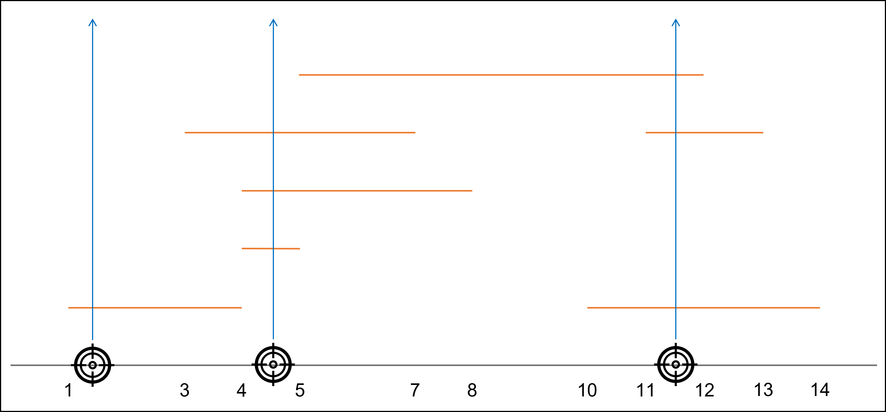

# Algorithm
[문제 바로가기](https://school.programmers.co.kr/learn/courses/30/lessons/42884)
# 문제 설명

고속도로를 이동하는 모든 차량이 고속도로를 이용하면서 단속용 카메라를 한 번은 만나도록 카메라를 설치하려고 합니다.

고속도로를 이동하는 차량의 경로 routes가 매개변수로 주어질 때, 모든 차량이 한 번은 단속용 카메라를 만나도록 하려면 최소 몇 대의 카메라를 설치해야 하는지를 return 하도록 solution 함수를 완성하세요.

# **제한사항**

- 차량의 대수는 1대 이상 10,000대 이하입니다.
- routes에는 차량의 이동 경로가 포함되어 있으며 routes[i][0]에는 i번째 차량이 고속도로에 진입한 지점, routes[i][1]에는 i번째 차량이 고속도로에서 나간 지점이 적혀 있습니다.
- 차량의 진입/진출 지점에 카메라가 설치되어 있어도 카메라를 만난것으로 간주합니다.
- 차량의 진입 지점, 진출 지점은 -30,000 이상 30,000 이하입니다.

# **입출력 예**

| routes                                    | return |
| ----------------------------------------- | ------ |
| [[-20,-15], [-14,-5], [-18,-13], [-5,-3]] | 2      |

# **입출력 예 설명**

-5 지점에 카메라를 설치하면 두 번째, 네 번째 차량이 카메라를 만납니다.

-15 지점에 카메라를 설치하면 첫 번째, 세 번째 차량이 카메라를 만납니다.

# 풀이

해당 문제는 `Greed`를 활용하면 해결 할 수 있는 문제입니다.

해당 문제는 [프로그래머스 요격시스템](https://school.programmers.co.kr/learn/courses/30/lessons/181188)에 나와있는 문제와 굉장히 동일 합니다.



우선 진입 지점 기준으로 정렬을 하단면 위와 같은 그림을 그려 볼 수 있습니다.

이후 겹쳐있다면 카운트 해주고 겹치지 않았다면 카운트 하지 않습니다.

위의 로직이 나오는 이유는 모든 곳에 카메라 1개는 무조건 설치 되어야하기 때문에 위의 방식대로 진행 할 수 있는 것 입니다.

그럼 겹쳤다는 것을 판단 할 수 있어야합니다.

정렬이 되어 있을 때 진출점 보다 다음 차량의 진입점이 작다면 겹쳐있다고 볼 수 있습니다.

이때 진출점은 가장 빠른 지점으로 항상 가지고 있어야하므로 겹쳐있다면 겹친 것둘중 진출점이 가장 빠른 것으로 진출점과 비교하면 최소의 설치 갯수를 알 수 있습니다.

```java

import java.util.*;

class Solution {
    public int solution(int[][] routes) {
        int answer = 1;
        Arrays.sort(routes, (o1, o2) -> {
           return o1[0] - o2[0]; 
        });
        
        int end = routes[0][1];
        for (int i = 1; i < routes.length; ++i) {
            if (end  < routes[i][0]) {
                ++answer;
                end = routes[i][1];
            } else {
                end = Math.min(end,routes[i][1]);   
            }
        }
        return answer;
    }
}

```