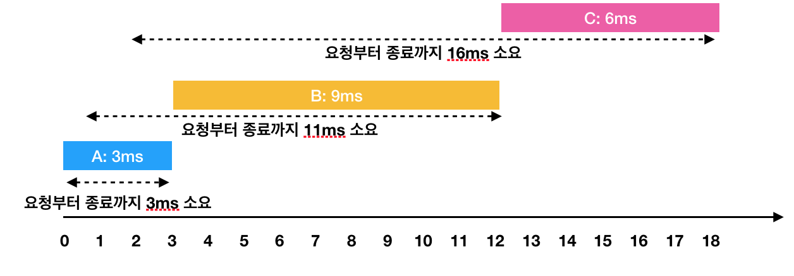
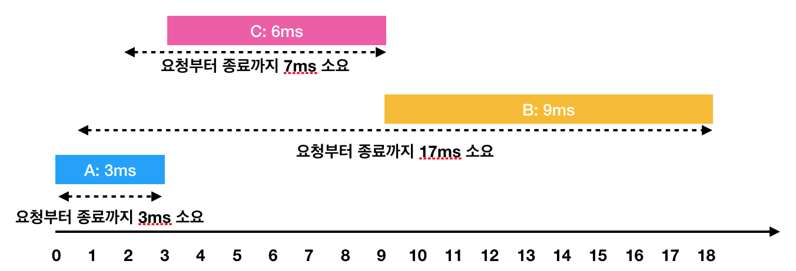
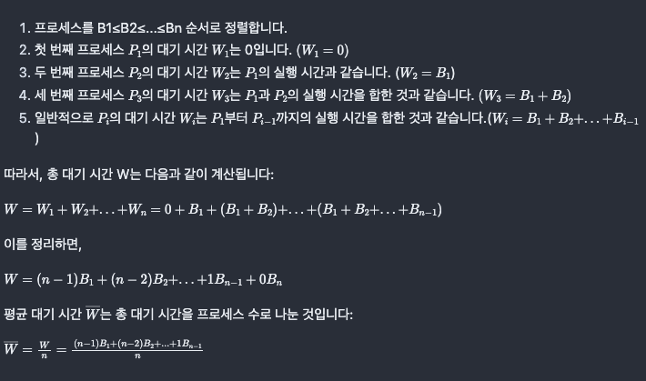

# 문제 설명

하드디스크는 한 번에 하나의 작업만 수행할 수 있습니다. 디스크 컨트롤러를 구현하는 방법은 여러 가지가 있습니다. 가장 일반적인 방법은 요청이 들어온 순서대로 처리하는 것입니다.

예를들어

```
- 0ms 시점에 3ms가 소요되는 A작업 요청
- 1ms 시점에 9ms가 소요되는 B작업 요청
- 2ms 시점에 6ms가 소요되는 C작업 요청
```

와 같은 요청이 들어왔습니다. 이를 그림으로 표현하면 아래와 같습니다.  


한 번에 하나의 요청만을 수행할 수 있기 때문에 각각의 작업을 요청받은 순서대로 처리하면 다음과 같이 처리 됩니다.  


```
- A: 3ms 시점에 작업 완료 (요청에서 종료까지 : 3ms)
- B: 1ms부터 대기하다가, 3ms 시점에 작업을 시작해서 12ms 시점에 작업 완료(요청에서 종료까지 : 11ms)
- C: 2ms부터 대기하다가, 12ms 시점에 작업을 시작해서 18ms 시점에 작업 완료(요청에서 종료까지 : 16ms)
```

이 때 각 작업의 요청부터 종료까지 걸린 시간의 평균은 10ms(= (3 + 11 + 16) / 3)가 됩니다.

하지만 A → C → B 순서대로 처리하면  


```
- A: 3ms 시점에 작업 완료(요청에서 종료까지 : 3ms)
- C: 2ms부터 대기하다가, 3ms 시점에 작업을 시작해서 9ms 시점에 작업 완료(요청에서 종료까지 : 7ms)
- B: 1ms부터 대기하다가, 9ms 시점에 작업을 시작해서 18ms 시점에 작업 완료(요청에서 종료까지 : 17ms)
```

이렇게 A → C → B의 순서로 처리하면 각 작업의 요청부터 종료까지 걸린 시간의 평균은 9ms(= (3 + 7 + 17) / 3)가 됩니다.

각 작업에 대해 [작업이 요청되는 시점, 작업의 소요시간]을 담은 2차원 배열 jobs가 매개변수로 주어질 때, 작업의 요청부터 종료까지 걸린 시간의 평균을 가장 줄이는 방법으로 처리하면 평균이 얼마가 되는지 return 하도록 solution 함수를 작성해주세요. (단, 소수점 이하의 수는 버립니다)

# 제한 사항

- jobs의 길이는 1 이상 500 이하입니다.
- jobs의 각 행은 하나의 작업에 대한 [작업이 요청되는 시점, 작업의 소요시간] 입니다.
- 각 작업에 대해 작업이 요청되는 시간은 0 이상 1,000 이하입니다.
- 각 작업에 대해 작업의 소요시간은 1 이상 1,000 이하입니다.
- 하드디스크가 작업을 수행하고 있지 않을 때에는 먼저 요청이 들어온 작업부터 처리합니다.

# 입출력 예

| jobs                     | return |
| ------------------------ | ------ |
| [[0, 3], [1, 9], [2, 6]] | 9      |

# 입출력 예 설명

문제에 주어진 예와 같습니다.

- 0ms 시점에 3ms 걸리는 작업 요청이 들어옵니다.
- 1ms 시점에 9ms 걸리는 작업 요청이 들어옵니다.
- 2ms 시점에 6ms 걸리는 작업 요청이 들어옵니다.

# 풀이

 해당 문제는 SJF를 이용하면 해결할 수 있는 문제입니다.
우선 SJF란 실행 시간이 가장 짤은 작업을 우선순위로 두고 스케줄링을하는 알고리즘입니다.
해당 알고리즘은 평균대시간을 가장 짧게 만들어주는 스케줄링 알고리즘으로 해당문제에서 요구하는 것에 가장 적합한 알고리즘입니다.

그럼 간단하게 SJF가 왜? 가장 짧은 스케줄링 알고리즘인지 확인해 보겠습니다.

Shortest Job First (SJF) 스케줄링 알고리즘이 평균 대기 시간이 가장 짧다는 것을 증명하기 위해, 우리는 프로세스의 도착 시간과 실행 시간을 고려하여 그들의 대기 시간을 계산하고 비교할 것입니다. 이를 수학적으로 증명하기 위해, 우리는 몇 가지 가정을 사용합니다.

가정:

1. 모든 프로세스가 동시에 도착한다.
2. 프로세스의 실행 시간(버스트 타임)이 이미 알려져 있다.

### 증명

#### 용어 정의

- $n$: 프로세스의 수
- $P_i$​: i번째 프로세스
- $B_i$​: $P_i$​의 실행 시간 (Burst Time)
- $W_i$​: $P_i$​의 대기 시간 (Waiting Time)

#### SJF의 대기 시간 계산

SJF 알고리즘은 실행 시간이 가장 짧은 프로세스를 먼저 실행합니다. 이를 위해 BiB_iBi​가 작은 순서대로 프로세스를 정렬합니다.



#### 다른 스케줄링 알고리즘과의 비교

다른 스케줄링 알고리즘과 비교해 보겠습니다. 예를 들어, First-Come-First-Served (FCFS) 스케줄링을 사용한다고 가정합니다. FCFS의 경우, 대기 시간은 프로세스 도착 순서에 따라 다릅니다. 그러나, SJF는 실행 시간이 짧은 프로세스를 우선 실행하기 때문에, 이후 실행되는 프로세스들이 비교적 짧은 실행 시간을 가지게 되어 전체 대기 시간이 최소화됩니다.

다른 스케줄링 알고리즘에서는 긴 실행 시간을 가지는 프로세스가 앞에 위치할 경우, 후속 프로세스들의 대기 시간이 크게 증가할 수 있습니다. SJF는 이를 방지하여 평균 대기 시간을 최소화합니다.

### 결론

SJF 스케줄링 알고리즘은 실행 시간이 짧은 프로세스를 우선적으로 실행하기 때문에, 각 프로세스의 대기 시간이 최소화되며, 결과적으로 평균 대기 시간이 다른 스케줄링 알고리즘보다 짧아지게 됩니다. 이는 위의 수학적 증명을 통해 확인할 수 있습니다.

## 풀이

 그럼 다시 문제로 넘어와서 위에서 길게 설명을 했지만 즉 들어오는 순서대로 가장 짧은 것을 선택하여 실행하면 되다는 간단한 말입니다.

우선 들어오는 순서대로 정렬을 해준뒤 1초씩 증가 시키며 해당 요청 작업이 들어오면 실행시간을 우선순위로하는 우선순위 큐에 넣어줍니다.

만약 현제 작업하는 프로세스가 있다면 종료할 수 있는지 확인후 종료할 수 있다면 종료를 합니다.

만약 현제 작업중인 프로세스가 없고 우선순위 큐에는 작업이 들어 있다면 해당 작업을 실행합니다.

위의 과정을 들어오는 모든 프로세스에 대하여 수행하면 문제를 해결할 수 있습니다.

``` java

import java.util.*;

class Job implements Comparable<Job> {
    int runTime;
    int startTime;
    int requirTime;
    
    public Job(int requirTime, int runTime) {
        this.runTime = runTime;
        this.requirTime = requirTime;
    }
    
    @Override
    public int compareTo(Job o) {
        return runTime - o.runTime;
    }
    
    @Override
    public String toString() {
        return "job : {" + "startTime=" + startTime + ", runTime=" + runTime + ", requirTime=" + requirTime + "}";
    }
}

class Solution {
    public int solution(int[][] jobs) {
        Job currJob = null;
        List<Job> jobList = getJobList(jobs);
        PriorityQueue<Job> pq = new PriorityQueue<>();
        
        for (int i = 0, time = 0; i < jobs.length || !pq.isEmpty(); ++time) {
            while (i < jobs.length && time == jobs[i][0]) {
                pq.add(jobList.get(i));
                ++i;
            }
            if (currJob != null && time - currJob.startTime == currJob.runTime) {
                currJob = null;
            }
            if (currJob == null && !pq.isEmpty()) {
                currJob = pq.poll();
                currJob.startTime = time;
            }
        }
        return getAverage(jobList);
    }
    
    private List<Job> getJobList(int[][] jobs) {
        List<Job> jobList = new ArrayList<>(jobs.length);
        
        Arrays.sort(jobs, new Comparator<int[]>() {
            @Override
            public int compare(int[] o1, int[] o2) {
                return o1[0] - o2[0];
            }
        });
        for (int i = 0; i < jobs.length; ++i) {
            jobList.add(new Job(jobs[i][0], jobs[i][1]));
        }
        return jobList;
    }
    
    private int getAverage(List<Job> jobList) {
        int totalTime = 0;
        for (Job j : jobList) {
            totalTime += (j.startTime + j.runTime - j.requirTime);
        }
        return totalTime / jobList.size();
    }
}

```