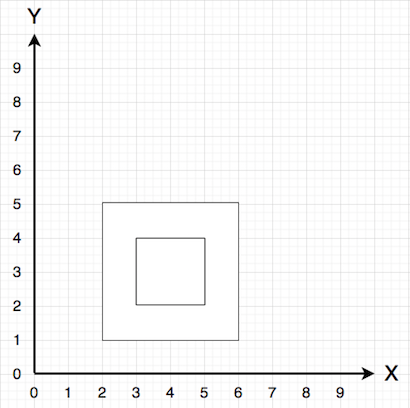
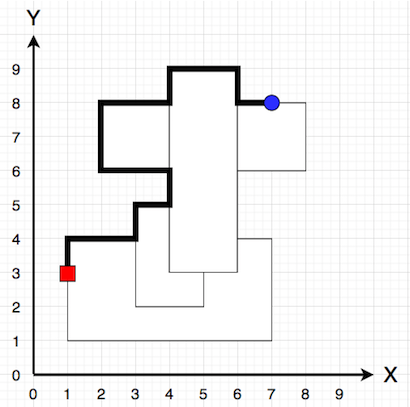
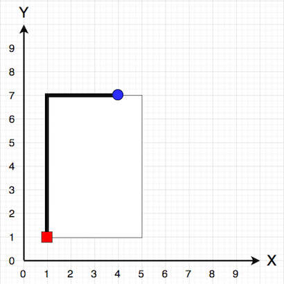

# Algorithm

[문제 바로가기](https://school.programmers.co.kr/learn/courses/30/lessons/87694)

# 문제 설명

다음과 같은 다각형 모양 지형에서 캐릭터가 아이템을 줍기 위해 이동하려 합니다.


지형은 각 변이 x축, y축과 평행한 직사각형이 겹쳐진 형태로 표현하며, 캐릭터는 이 다각형의 둘레(굵은 선)를 따라서 이동합니다.

만약 직사각형을 겹친 후 다음과 같이 중앙에 빈 공간이 생기는 경우, 다각형의 가장 바깥쪽 테두리가 캐릭터의 이동 경로가 됩니다.


단, 서로 다른 두 직사각형의 x축 좌표 또는 y축 좌표가 같은 경우는 없습니다.


즉, 위 그림처럼 서로 다른 두 직사각형이 꼭짓점에서 만나거나, 변이 겹치는 경우 등은 없습니다.

다음 그림과 같이 지형이 2개 이상으로 분리된 경우도 없습니다.


한 직사각형이 다른 직사각형 안에 완전히 포함되는 경우 또한 없습니다.



지형을 나타내는 직사각형이 담긴 2차원 배열 rectangle, 초기 캐릭터의 위치 characterX, characterY, 아이템의 위치 itemX, itemY가 solution 함수의 매개변수로 주어질 때, 캐릭터가 아이템을 줍기 위해 이동해야 하는 가장 짧은 거리를 return 하도록 solution 함수를 완성해주세요.

# 제한사항

- rectangle의 세로(행) 길이는 1 이상 4 이하입니다.
- rectangle의 원소는 각 직사각형의 [좌측 하단 x, 좌측 하단 y, 우측 상단 x, 우측 상단 y] 좌표 형태입니다.
    - 직사각형을 나타내는 모든 좌표값은 1 이상 50 이하인 자연수입니다.
    - 서로 다른 두 직사각형의 x축 좌표, 혹은 y축 좌표가 같은 경우는 없습니다.
    - 문제에 주어진 조건에 맞는 직사각형만 입력으로 주어집니다.
- charcterX, charcterY는 1 이상 50 이하인 자연수입니다.
    - 지형을 나타내는 다각형 테두리 위의 한 점이 주어집니다.
- itemX, itemY는 1 이상 50 이하인 자연수입니다.
    - 지형을 나타내는 다각형 테두리 위의 한 점이 주어집니다.
- 캐릭터와 아이템의 처음 위치가 같은 경우는 없습니다.

---

- 전체 배점의 50%는 직사각형이 1개인 경우입니다.  
    
- 전체 배점의 25%는 직사각형이 2개인 경우입니다.  
    
- 전체 배점의 25%는 직사각형이 3개 또는 4개인 경우입니다.  
    

---

# 입출력 예

|rectangle|characterX|characterY|itemX|itemY|result|
|---|---|---|---|---|---|
|[[1,1,7,4],[3,2,5,5],[4,3,6,9],[2,6,8,8]]|1|3|7|8|17|
|[[1,1,8,4],[2,2,4,9],[3,6,9,8],[6,3,7,7]]|9|7|6|1|11|
|[[1,1,5,7]]|1|1|4|7|9|
|[[2,1,7,5],[6,4,10,10]]|3|1|7|10|15|
|[[2,2,5,5],[1,3,6,4],[3,1,4,6]]|1|4|6|3|10|

## 입출력 예 설명

### 입출력 예 #1



캐릭터 위치는 (1, 3)이며, 아이템 위치는 (7, 8)입니다. 위 그림과 같이 굵은 선을 따라 이동하는 경로가 가장 짧습니다.

### 입출력 예 #2


캐릭터 위치는 (9, 7)이며, 아이템 위치는 (6, 1)입니다. 위 그림과 같이 굵은 선을 따라 이동하는 경로가 가장 짧습니다.

### 입출력 예 #3



캐릭터 위치는 (1, 1)이며, 아이템 위치는 (4, 7)입니다. 위 그림과 같이 굵은 선을 따라 이동하는 경로가 가장 짧습니다.

입출력 예 #4, #5

설명 생략

# 풀이

해당 문제는 `DFS / BFS`를 이용하면 해결할 수 있는 문제입니다.

해당 문제의 기본 아이디어는 모든 사각형을 그린 뒤 배경에서 아웃 라인만 딴다는 것입니다.

흔히 누끼를 딴다고 할때 사용하는 방법입니다.

우선 board에 사각형을 모두 그려줍니다.

이때 주의할 점은 그릴 때, point를 잡기 때문에 예시에 주어진 x, y 좌표 처럼 선분을 나타 낼 수 없기 때문에 map에 그릴때는 전부 2배를 하여 그림을 그려줍니다.

이후 테두리 만을 추출하기 위해 배경을 전부 탐색하며 배경과 인접한 부분을 표기해 줍니다.

또한 주의한 점은 배경에 인접한 부분을 표기하면 두 선분의 교차점을 표기 할 수 없음으로 만약 교차점이 있는 경우는 따료 표기해 주어야합니다.

이렇게 테두리만이 추출되면 테두리를 따라 출발지 부터 목적지 까지 `BFS`를 수행하며 도착지까지 칸수를 카운트 해 주고 카운트 한 값의 `1/2`을 반환하면 해결 할 수 있습니다.

```java

import java.util.*;

class Solution {
    private static final int SIZE = 102;
    private static final int[] DR = {-1,0,1,0};
    private static final int[] DC = {0,-1,0,1};
    
    private int[][] board;
    
    public int solution(int[][] rectangle, int characterX, int characterY, int itemX, int itemY) {
        drawBoard(rectangle);
        return findItem(new int[]{characterX*2, characterY*2}, new int[]{itemX*2, itemY*2})/2;
    }
    
    private int findItem(int[] start, int[] end) {
        int[] curr = new int[] {start[0], start[1], 0};
        Queue<int[]> que = new ArrayDeque<>();
        boolean[][] visited = new boolean[SIZE][SIZE];
        
        que.add(curr);
        while (!que.isEmpty()) {
            curr = que.poll();
            
            if (curr[0] == end[0] && curr[1] == end[1]) {
                return curr[2];
            }
            
            if (!visited[curr[0]][curr[1]]) {
                visited[curr[0]][curr[1]] = true;
                
                for (int i = 0; i < 4; ++i) {
                    int nextR = curr[0] + DR[i];
                    int nextC = curr[1] + DC[i];
                    
                    if (isValidate(nextR, nextC) && 
                        !visited[nextR][nextC] && 
                        board[nextR][nextC] == -1) 
                    {
                        que.add(new int[]{nextR, nextC, curr[2] + 1});
                    }
                }
            } 
        }
        return -1;
    }
    
    private void drawBoard(int[][] rectangle) {
        int count = 0;
        
        board = new int[SIZE][SIZE];
        for (int[] rect : rectangle) {
            drawLine(new int[][] {
                {rect[0]*2, rect[1]*2, rect[2]*2, rect[1]*2},
                {rect[0]*2, rect[3]*2, rect[2]*2, rect[3]*2},
                {rect[0]*2, rect[1]*2, rect[0]*2, rect[3]*2},
                {rect[2]*2, rect[1]*2, rect[2]*2, rect[3]*2},
            }, ++count);
        }
        findOutLine();
        //printBoard();
    }
    
    private void drawLine(int[][] lines, int seq) {
        for (int[] l : lines) {
            for (int x = l[0]; x <= l[2]; ++x) {
                for (int y = l[1]; y <= l[3]; ++y) {
                    board[x][y] = seq;
                }
            }
        }
    }
    
    private void findOutLine() {
        int[] curr = new int[]{0,0};
        Queue<int[]> que = new ArrayDeque<>();
        boolean[][] visited = new boolean[SIZE][SIZE];
        
        que.add(curr);
        while (!que.isEmpty()) {
            curr = que.poll();
            
            if (!visited[curr[0]][curr[1]]) {
                visited[curr[0]][curr[1]] = true;
                
                for (int i = 0; i < 4; ++i) {
                    int nextR = curr[0] + DR[i];
                    int nextC = curr[1] + DC[i];
                    
                    if (isValidate(nextR, nextC)) {
                        if (board[nextR][nextC] != 0) {
                            board[nextR][nextC] = -1;
                        } else if (!visited[nextR][nextC]) {
                            que.add(new int[]{nextR, nextC});
                        }
                    }
                }
                findCrossPoint(curr);
            }
        }
    }
    
    private void findCrossPoint(int[] point) {
        for (int i = 0; i < 4; ++i) {
            int[] a = new int[]{point[0] + DR[i], point[1] +DC[i]};
            int[] b = new int[]{point[0] + DR[(i+1)%4], point[1] + DC[(i+1)%4]};
            
            if (isValidate(a[0], a[1]) && 
                isValidate(b[0], b[1]) && 
                board[a[0]][a[1]] == -1 && 
                board[b[0]][b[1]] == -1) 
            {
                int r = point[0] + DR[i] + DR[(i+1)%4];
                int c = point[1] + DC[i] + DC[(i+1)%4];
                board[r][c] = -1;
            }
        }
    }
    
    private boolean isValidate(int r, int c) {
        return (0 <= r && r < SIZE && 0 <= c && c < SIZE);
    }
    
    private void printBoard() {
        for (int i = 50; i >= 0; --i) {
            for (int j = 0; j < 50; ++j) {
                System.out.print(board[j][i] != -1 ? "  " : board[j][i]);
            }
            System.out.println();
        }
    }
}

```