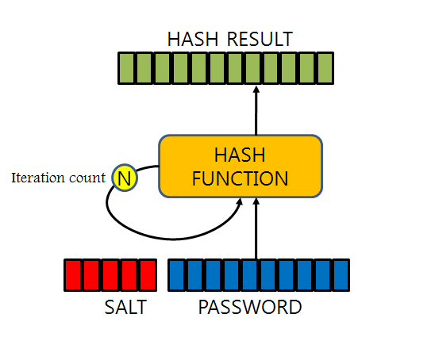
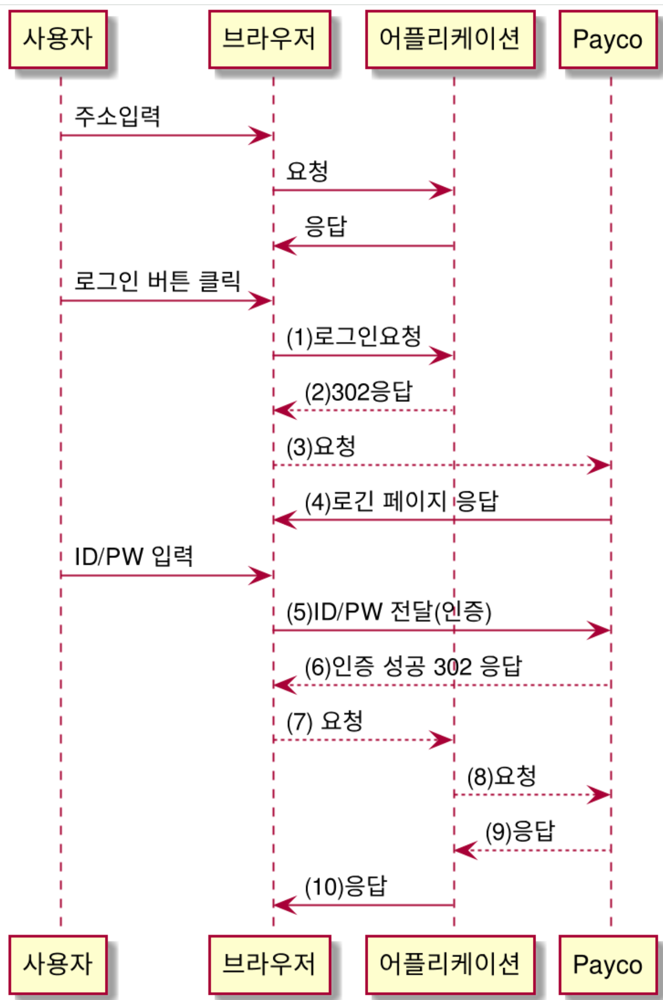

# 로그인/로그아웃 커스터마이즈

## `formLogin()` 커스터마이즈

### login-page

- 로그인 폼 URL
    
- default: `GET /login`
    

### login-processing-url

- 로그인 처리 URL
    
- default: `POST /login`
    

### username-parameter

### password-parameter

### authentication-success-handler

### authentication-failure-handler

```java
http.csrf(AbstractHttpConfigurer::disable);
        http.formLogin((formLogin) ->
                            formLogin.loginPage("/auth/login")
                                        .usernameParameter("id")
                                        .passwordParameter("pwd")
                                        .loginProcessingUrl("/login/process")

                      );
```

## `logout()` 커스터마이징

### delete-cookies

- 삭제할 쿠키 이름을 comma 로 구분해서 지정
    

### logout-success-url

- 로그아웃 성공 후 리다이렉트될 url
    

### success-handler-ref

```java
http.logout((logout)->logout.deleteCookies("A-COOKIE", "B-COOKIE")
                                            .invalidateHttpSession(true)
                                            .logoutUrl("/auth/logout")
                                            .logoutSuccessUrl("/"));
```

## 권한 없음 403 화면 커스터마이징

### `accessDeniedPage()` 설정

- 권한 없음 오류 발생 시 리다이렉트될 url
    

```java
http
    .exceptionHandling()
        .accessDeniedPage("/error/403")
```
# Security (with redis)

## 로그인을 잘 구현했지만 문제가 없을까???

Spring Security에서 SecurityContextRepository는 SecurityContext를 저장하고 로드하는 역할

> HttpSessionSecurityContextRepository  
> HttpSession에 SecurityContext를 저장

HttpSession 객체는 웹 애플리케이션 서버의 메모리에 저장

### 문제점

```
서버 재시작: 서버가 재시작되면 모든 세션 데이터가 손실됩니다.
메모리 사용: 많은 세션 데이터가 메모리를 차지하여 서버의 메모리 사용량이 증가합니다.
확장성: 여러 대의 서버가 있는 분산 환경에서는 세션을 공유하기 어렵습니다. 클라이언트가 다른 서버로 요청을 보낼 때 세션 데이터를 사용할 수 없기 때문입니다.
```

## EnableRedisHttpSession

### RedisConfig.java 파일에 @EnableRedisHttpSession추가

```java
@EnableRedisHttpSession
@Configuration
public class RedisConfig {
    @Bean
```

`RedisIndexedSessionRepository.java`

# 취약점 공격 방어 기능

## Spring Boot 에서의 Spring Security

## Security Http Response Headers

- Cache Control
    
- Content Type Options
    
- X-Frame-Options
    
- X-XSS-Protection
    
- HSTS (HTTP Strict Transport Security)
    

## Cache Control

- 기본값: `Cache-Control: no-cache, no-store, max-age=0, must-revalidate`
    
- cache-control 직접 제어 하려면
    

```java
http
      .headers()
          .defaultsDisabled()
          .cacheControl()/*.disable()*/
```

## Content Type Options

- 기본값: `X-Content-Type-Options: nosniff`
    
- content-type-options 직접 제어 하려면
    

```java
http
      .headers()
          .defaultsDisabled()
          .contentTypeOptions()/*.disable()*/
```

## X-Frame-Options

- 기본값: `X-Frame-Options: DENY`
    
- frame-options 직접 제어 하려면
    

```java
http
      .headers()
          .frameOptions().sameOrigin()
```

## X-XSS-Protection

- 기본값: `X-XSS-Protection: 1; mode=block`
    

```
http
      .headers()
          .xssProtection
              .block(true)
```

## HSTS (HTTP Strict Transport Security)

- 기본값: `Strict-Transport-Security: max-age=31536000 ; includeSubDomains`
    

```java
http
      .headers()
          .httpStrictTransportSecurity()
              .includeSubdomains(true)
              .maxAgeSeconds(31536000)
```

## CSRF 방어

### CSRF (Cross Site Request Fogery: 사이트간 요청 위조)

```java
http
      .csrf()
          //.disable()
```

- CSRF Token
    
    - cf.) Spring Security JSP Tag Library
        

### Test : spring-security-test

## 비밀번호 저장 방법

### 단순 텍스트 (plain text)

- 절대 금물!!!
    

### 단방향 해시 함수(one-way hash function)의 다이제스트(digest)

## 해시 (hash)

### 해시 함수 (hash function)

- 임의의 길이를 갖는 임의의 데이터를 고정된 길이의 데이터로 매핑하는 단방향 함수
    


### 해시 함수의 리턴 값

- 해시 값(hash value), hash code, 다이제스트(digest), 그냥 해시(hash)
    

## 비밀번호를 해시 값으로 저장하는 이유?

### 해시의 특성

- 해시는 고정 길이 → 원문이 손실된다
    
    - 해시 값으로 원문 복원 불가능
        
- 원문과 해시 값 사이에 선형적인 관계가 없다
    

## 잘 알려진 해시 알고리즘

### MD5 (Message-Digest algorithm 5)

- 128비트 길이
    

### SHA-1 (Secure Hash Algorithm 1)

- 160비트 길이
    

### SHA-256

- 256비트 길이
    

## 단방향 해시 함수의 문제점

### 인식 가능성 (recognizability)

- 동일한 메시지는 동일한 다이제스트를 갖는다
    

### 속도 (speed)

- 해시 함수는 원래 빠른 데이터 검색을 위한 목적으로 설계된 것
    
- 해시 함수의 빠른 처리 속도로 인해 공격자는 매우 빠른 속도로 임의의 문자열의 다이제스트와 해킹할 대상의 다이제스트를 비교할 수 있다
    

## 단방향 해시 함수 보완하기

### 방법은?

소금!

## 단방향 해시 함수 보완하기

### salt

- 단방향 해시 함수에서 다이제스트를 생성할 때 추가되는 바이트 단위의 임의의 문자열
    
- 특정 비밀번호의 다이제스트를 안다고 하더라도 salt가 추가되면 비밀번호 일치 여부 확인이 어려움
    
- salt의 길이는 32바이트 이상이어야 추측하기 어려움
    

### 키 스트레칭 (key stretching)

- 입력한 비밀번호의 다이제스트를 생성하고
    
- 생성된 다이제스트를 입력 값으로 하여 다이제스트를 생성하고
    
- 또 이를 반복하는 방법으로 다이제스트를 생성해서
    
- 입력한 비밀번호를 동일한 횟수만큼 해시해야만 입력한 비밀번호의 일치 여부를 확인할 수 있는 방법
    

  
[https://d2.naver.com/helloworld/318732](https://d2.naver.com/helloworld/318732)

## 비밀번호에 단방향 해시 함수 적용

```java
MessageDigestPasswordEncoder encoder = new MessageDigestPasswordEncoder("SHA-256");
        encoder.setSaltSource(saltSource());
        return encoder;
```

~~new MessageDigestPasswordEncoder("SHA-256");~~

`BCryptPasswordEncoder`

```java
public String encode(CharSequence rawPassword) {
        if (rawPassword == null) {
            throw new IllegalArgumentException("rawPassword cannot be null");
        } else {
            String salt = this.getSalt();
            return BCrypt.hashpw(rawPassword.toString(), salt);
        }
    }
    
```

## OAuth2

# OAuth 기본 개념

## OAuth

- 인터넷 사용자가
    
    - 다른 웹사이트에 있는 자신의 사용자 정보를
        
        - 비밀번호를 직접 제공하지 않고도
            
    - 특정 웹사이트나 애플리케이션에게 접근을 허용해줄 있도록 해주는
        
- 접근 위임을 위한 개방형 표준
    

```
OAuth is an open standard for access delegation,
commonly used as a way
for Internet users to grant websites or applications access to their information on other websites
but without giving them the passwords
```

[https://en.wikipedia.org/wiki/OAuth](https://en.wikipedia.org/wiki/OAuth)

## OAuth History

### History

- 2010.04, RFC 5849 - OAuth 1.0
    
- 2012.10, RFC 6749 - OAuth 2.0
    

### OAuth2

[https://tools.ietf.org/html/rfc6749](https://tools.ietf.org/html/rfc6749)

## Role

- `Resource owner` - 자원에 대한 접근을 허가해줄 수 있는 주체
    
- `Resource server` - 자원을 호스팅하는 서버
    
- `Client` - Resource Server 에서 제공하는 자원을 사용하는 애플리케이션
    
- `Authorization Server`
    
    - 사용자의 동의를 받아서 권한을 부여하는 서버
        
    - 일반적으로 Resource Server 와 같은 URL 하위에 있는 경우가 많음
        

### 페이스북의 뉴스 피드를 모아서 보여주는 모바일 앱을 가정하면

|Role|페이스북을 예로 들면...|
|---|---|
|Resource Owner|페이스북 사용자|
|Resource Server|페이스북 서버|
|Client|페이스북의 뉴스 피드를 모아서 보여주는 앱|
|Authorization Server|페이스북 서버|

## Protocol Flow

```
     +--------+                               +---------------+
     |        |--(A)- Authorization Request ->|   Resource    |
     |        |                               |     Owner     |
     |        |<-(B)-- Authorization Grant ---|               |
     |        |                               +---------------+
     |        |
     |        |                               +---------------+
     |        |--(C)-- Authorization Grant -->| Authorization |
     | Client |                               |     Server    |
     |        |<-(D)----- Access Token -------|               |
     |        |                               +---------------+
     |        |
     |        |                               +---------------+
     |        |--(E)----- Access Token ------>|    Resource   |
     |        |                               |     Server    |
     |        |<-(F)--- Protected Resource ---|               |
     +--------+                               +---------------+
```

## Grant Type

- Authorization Code Grant ✔︎
    
    - `response_type=code`
        
- Implicit Grant
    
    - `response_type=token`
        
- Resource Owner Password Credentials Grant
    
    - `grant_type=password&username=&password=`
        
- Client Credentials Grant
    
    - `grant_type=client_credentials`
        

## Authorization Code Grant



### (3) Authorization 요청

```http
GET
{https://alpha-id.payco.com/oauth2.0/authorize
    ?response_type=code
    &state={random_string}
    &client_id={client_id}
    &serviceProviderCode=
    &redirect_uri=}
```

### (7) Authorization Grant

```http
GET
{http://application
    ?code={code}
    &state={random_string}}
```

### (8) Access Token 요청

```http
POST
{https://alpha-id.payco.com/oauth2.0/token
	grant_type=authorization_code
	&code={code}
	&client_id={client_id}
	&client_secret={client_secret}}
```

### (9) Access Token 응답

```http
{
    "access_token_secret":"4XIFI6WV08rPbgzl",
    "state":null,
    "expires_in":"1209600",
    "token_type":"Bearer",
    "access_token":"AAAA4NV74n+ns623iceBuM1MfWzb3iq5kNfC4cMZ0A5T5pGjwfMF5b/Yj+LyDBqK8+/jvVTIKHbzM47wFw8qUf0fTCw4+/ko+hSgAGClMLykvaDJ7/0B/OxlMmkml2hJPQp96DqV6AqkvAw4niLVho14Izga2c5IksQOjTTv5L8keM4yTplN50xzGzYJpV1vmj3NGWtPKHaJL3fLVa41hvZmxOw00edQeOYAw/vhLW7iQDuJjpTciWgmgEUd9if7EL+tqIJmE6fRSH42b4aNOX5XgiaEr6hUDisUoHG5kqOd",
    "refresh_token":"AAAAb7F2pdU0FZuxHreJDA2TnpkyB5fw8vwRwdaQaMaEKDwlspr/LIsbLGHdW85lVuJ3OaNDguDnGx5+FZeZaIbBTDRBcaneT9WlrDNORX8eyVf5bgL6RrENn5tKhjdjQlmsXxH1wCJDUa2J2QtQOHRTxAg="
}
```

Google OAuth2 Security를 통해 사용해보기.

