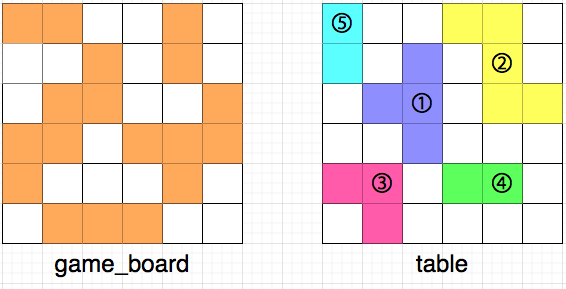
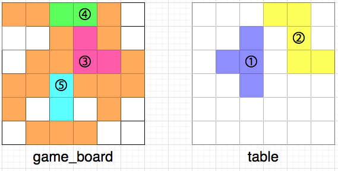
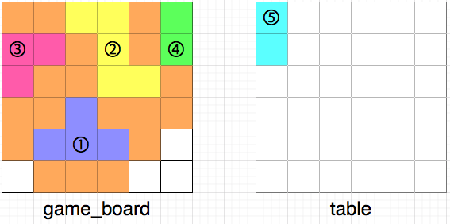
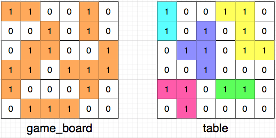

# Algorithm

[문제 바로가기](https://school.programmers.co.kr/learn/courses/30/lessons/84021)

# 문제 설명

테이블 위에 놓인 퍼즐 조각을 게임 보드의 빈 공간에 적절히 올려놓으려 합니다. 게임 보드와 테이블은 모두 각 칸이 1x1 크기인 정사각 격자 모양입니다. 이때, 다음 규칙에 따라 테이블 위에 놓인 퍼즐 조각을 게임 보드의 빈칸에 채우면 됩니다.

- 조각은 한 번에 하나씩 채워 넣습니다.
- 조각을 회전시킬 수 있습니다.
- 조각을 뒤집을 수는 없습니다.
- 게임 보드에 새로 채워 넣은 퍼즐 조각과 인접한 칸이 비어있으면 안 됩니다.

다음은 퍼즐 조각을 채우는 예시입니다.



위 그림에서 왼쪽은 현재 게임 보드의 상태를, 오른쪽은 테이블 위에 놓인 퍼즐 조각들을 나타냅니다. 테이블 위에 놓인 퍼즐 조각들 또한 마찬가지로 [상,하,좌,우]로 인접해 붙어있는 경우는 없으며, 흰 칸은 퍼즐이 놓이지 않은 빈 공간을 나타냅니다. 모든 퍼즐 조각은 격자 칸에 딱 맞게 놓여있으며, 격자 칸을 벗어나거나, 걸쳐 있는 등 잘못 놓인 경우는 없습니다.

이때, 아래 그림과 같이 3,4,5번 조각을 격자 칸에 놓으면 규칙에 어긋나므로 불가능한 경우입니다.



- 3번 조각을 놓고 4번 조각을 놓기 전에 위쪽으로 인접한 칸에 빈칸이 생깁니다.
- 5번 조각의 양 옆으로 인접한 칸에 빈칸이 생깁니다.

다음은 규칙에 맞게 최대한 많은 조각을 게임 보드에 채워 넣은 모습입니다.



최대한 많은 조각을 채워 넣으면 총 14칸을 채울 수 있습니다.

현재 게임 보드의 상태 `game_board`, 테이블 위에 놓인 퍼즐 조각의 상태 `table`이 매개변수로 주어집니다. 규칙에 맞게 최대한 많은 퍼즐 조각을 채워 넣을 경우, 총 몇 칸을 채울 수 있는지 return 하도록 solution 함수를 완성해주세요.

---

# 제한사항

- 3 ≤ `game_board`의 행 길이 ≤ 50
- `game_board`의 각 열 길이 = `game_board`의 행 길이
    - 즉, 게임 보드는 정사각 격자 모양입니다.
    - `game_board`의 모든 원소는 0 또는 1입니다.
    - 0은 빈칸, 1은 이미 채워진 칸을 나타냅니다.
    - 퍼즐 조각이 놓일 빈칸은 1 x 1 크기 정사각형이 최소 1개에서 최대 6개까지 연결된 형태로만 주어집니다.
- `table`의 행 길이 = `game_board`의 행 길이
- `table`의 각 열 길이 = `table`의 행 길이
    - 즉, 테이블은 `game_board`와 같은 크기의 정사각 격자 모양입니다.
    - `table`의 모든 원소는 0 또는 1입니다.
    - 0은 빈칸, 1은 조각이 놓인 칸을 나타냅니다.
    - 퍼즐 조각은 1 x 1 크기 정사각형이 최소 1개에서 최대 6개까지 연결된 형태로만 주어집니다.
- `game_board`에는 반드시 하나 이상의 빈칸이 있습니다.
- `table`에는 반드시 하나 이상의 블록이 놓여 있습니다.

---

# 입출력 예

|game_board|table|result|
|---|---|---|
|[[1,1,0,0,1,0],[0,0,1,0,1,0],[0,1,1,0,0,1],[1,1,0,1,1,1],[1,0,0,0,1,0],[0,1,1,1,0,0]]|[[1,0,0,1,1,0],[1,0,1,0,1,0],[0,1,1,0,1,1],[0,0,1,0,0,0],[1,1,0,1,1,0],[0,1,0,0,0,0]]|14|
|[[0,0,0],[1,1,0],[1,1,1]]|[[1,1,1],[1,0,0],[0,0,0]]|0|

---

## 입출력 예 설명

**입출력 예 #1**

입력은 다음과 같은 형태이며, 문제의 예시와 같습니다.



**입출력 예 #2**

블록의 회전은 가능하지만, 뒤집을 수는 없습니다.

# 풀이

해당 문제는 `DFS / BFS`로 분류가 되어있지만 사실상 거의 구현 문제에 가까운 문제입니다.

문제의 해결 아이디어는 이렇습니다.  

퍼즐의 조각을 넣었을때 인접한 곳에 빈공간이 있으면 않되므로 정확하게 빈곳과 일치하여야 합니다.

그러므로 보드의 빈 곳을 따로 분리하고 테이블의 조각을 따로 분리하여 돌려가며 서로 일치하는 것을 모두 카운트해 주면 됩니다.

그러므로 우선 테이블에서 조각을 따로 분리하여야 합니다. 

분리하기 위하여 모든 테이블의 위치를 순회하며 만약 1인 경우이며 한번도 방문하지 않은 곳이면 해당 위치를 기점으로 `DFS`또는 `BFS`를 수행하며 해당 조각을 포함하는 가장 작은 사각형의 배열을 만듭니다.

해당 과정이 끝나면 테이블의 모든 조각을 분리해 낼 수 있으며 동일하게 보드도 진행해 줍니다.

이때 보드는 0인 곳을 따로 분리해 주어야합니다.

보드의 조각에 대하여 테이블의 조각을 돌려가며 비교후 만약 일치한다면 해당 칸의 개수를 카운트하여 합산해 줍니다.

그럼 채울 수 있는 모든 곳에 대하여 카운트 할 수 있습니다.

```java

import java.util.*;

class Shape {
    private boolean[][] shape;
    
    public Shape(int[][] view, int[] start, int[] end, int type) {
        int row = end[0] - start[0] + 1;
        int col = end[1] - start[1] + 1;
        
        shape = new boolean[end[0] - start[0] + 1][end[1] - start[1] + 1];
        for (int r = 0; r < row; ++r) {
            for (int c = 0; c < col; ++c) {
                shape[r][c] = (view[r + start[0]][c + start[1]] == type);
            }
        }
    }
    
    public boolean[][] getShape() {return shape;}
    
    public int getCount(Shape other) {
        boolean[][] s = other.getShape();
        
        for (int i = 0; i < 4; ++i) {
            if (s.length == shape.length && s[0].length == shape[0].length) {
                int count = counting(s);
                
                if (count != -1) {
                    return count;
                }
            }
            s = rotateRight(s);
        }
        return 0;
    }
    
    private int counting(boolean[][] other) {
        int count = 0;
        
        for (int r = 0; r < other.length; ++r) {
            for (int c = 0; c < other[0].length; ++c) {
                if (shape[r][c] != other[r][c]) {
                    return -1;
                } else if (shape[r][c] && other[r][c]) {
                    ++count;   
                }
            }
        }
        return count;
    }
    
    private boolean[][] rotateRight(boolean[][] s) {
        int row = s.length;
        int col = s[0].length;
        boolean[][] rotate = new boolean[col][row];
        
        for (int r = 0; r < row; ++r) {
            for (int c = 0; c < col; ++c) {
                rotate[col - 1 - c][r] = s[r][c];
            }
        }
        return rotate;
    }
    
    @Override
    public String toString() {
        StringBuilder sb = new StringBuilder();
        for (int r = 0; r < shape.length; ++r) {
            for (int c = 0; c< shape[0].length; ++c) {
                sb.append(shape[r][c] ? '*' : ' ');
            }
            sb.append("\n");
        }
        return sb.toString();
    }
}

class Solution {
    private static final int[] DX = {-1,1,0,0};
    private static final int[] DY = {0,0,-1,1};
    
    private boolean[][] visited;
    
    public int solution(int[][] game_board, int[][] table) {
        int count = 0;
        Set<Shape> picies = getPicies(table, 1);
        Set<Shape> shapes = getPicies(game_board, 0);
        
        for (Shape s : shapes) {            
            for (Shape p : picies) {
                int mattch = s.getCount(p);
                
                if (mattch != 0) {
                    count += mattch;
                    picies.remove(p);
                    break;
                }
            }
        }
        return count;
    }
    
    private Set<Shape> getPicies(int[][] v, int type) {
        Set<Shape> picies = new HashSet<>();
        visited = new boolean[v.length][v[0].length];
        
        for (int r = 0; r < v.length; ++r) {
            for (int c = 0; c < v[0].length; ++c) {
                if (v[r][c] == type && !visited[r][c]) {
                    picies.add(getShape(r, c, v, type));
                }
            }
        }
        return picies;
    }
    
    private Shape getShape(int startR, int startC, int[][] v, int type) {
        int[] curr;
        int[] start = new int[]{startR, startC};
        int[] end = new int[]{startR, startC};
        Stack<int[]> stack = new Stack<>();
        
        stack.add(start);
        while (!stack.isEmpty()) {
            curr = stack.pop();
            
            if (!visited[curr[0]][curr[1]]) {
                visited[curr[0]][curr[1]] = true;
                end[0] = Math.max(end[0], curr[0]);
                end[1] = Math.max(end[1], curr[1]);
                start[0] = Math.min(start[0], curr[0]);
                start[1] = Math.min(start[1], curr[1]);
                
                for (int i =0; i < 4; ++i) {
                    int nextR = curr[0] + DX[i];
                    int nextC = curr[1] + DY[i];
                    if (isValidate(nextR, nextC, v.length, v[0].length) && 
                        v[nextR][nextC] == type) {
                       stack.add(new int[]{nextR, nextC}); 
                    }
                }
            }
        }
        return new Shape(v, start, end, type);
    }
    
    private boolean isValidate(int r, int c, int R, int C) {
        return (0 <= r && r < R && 0 <= c && c < C);
    }
}

```
