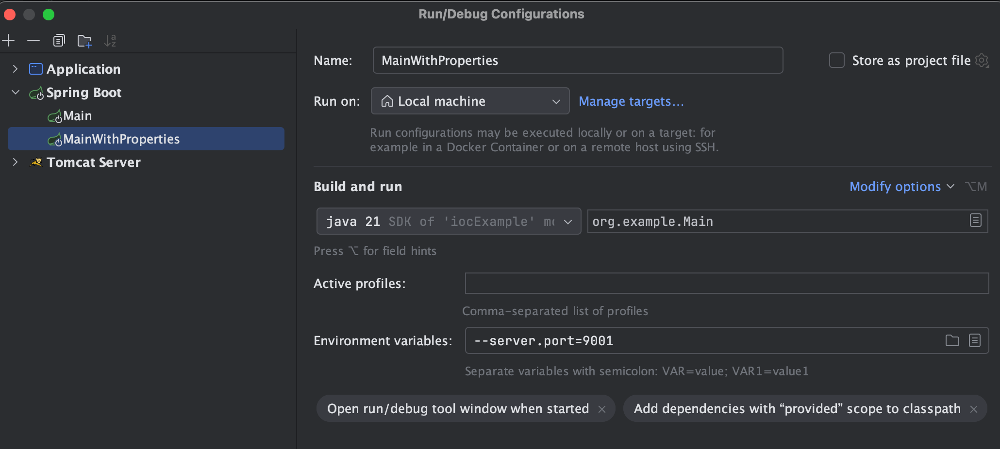
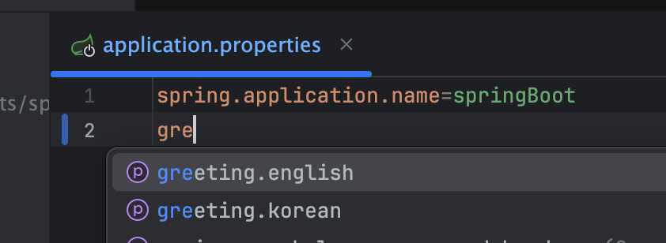

# ExternalizedConfiguration
## 자동구성 예제에서 왜 8080 포트로 어플리케이션이 동작했을까?

웹을 띄울 때 웹서버들은 ServerProperties 를 참조한다.

```properties
TomcatServletWebServerFactoryCustomizer.ServerProperties
ServletWebServerFactoryCustomizer.ServerProperties
JettyWebServerFactoryCustomizer.ServerProperties
```

- ServerProperties.java
    

```java
@ConfigurationProperties(prefix = "server", ignoreUnknownFields = true)
public class ServerProperties {

	/**
	 * Server HTTP port.
	 */
	private Integer port;

	/**
	 * Network address to which the server should bind.
	 */
	private InetAddress address;
	
	...
}
```

- 서버를 띄울 때 ServerProperties 의 port 값을 이용해서 띄우고 있다.  
    그렇다면 저 port 값을 바꾸면 우리가 원하는 다른 포트로 띄울 수 있지 않을까?
    

c.f) 내부적으로 port 값이 없다면 8080 으로 띄우도록 설정이 되어있다.  
TomcatServletWebServerFactory 참고.

## 포트를 바꿔보자

```java
@Component
@RequiredArgsConstructor
public class AppStartupRunner implements ApplicationRunner {

    private final ServerProperties serverProperties;


    @Override
    public void run(ApplicationArguments args) {

        System.out.println(serverProperties.getPort());

    }
}
```

```
server.port=9000
```

## 어떻게 가능했을까?

## Externalized Configuration

- spring-boot는 같은 소스 코드로 여러 환경에서 동작할 수 있도록 외부화 설정을 제공한다.
    
- `java properties, YAML, 환경변수, 실행 인자`로 설정 가능하다.
    
- 전체 프로젝트의 설정은 .properties, .yaml 중 하나만 사용하는 것을 권장한다.
    
- 같은 곳에 application.propreties, application.yaml 이 동시에 존재하면 application.propreties 가 우선한다.
    

### 외부구성(변수)만 수정했지만 어플리케이션의 동작이 바뀌는 것도 자동구성의 일부이다.

# Externalized Configuration 선언

## Command Line Properties (실행인자)

`--server.port=9001`



## 환경 변수

`SERVER_PORT=9002`


## java property (application.properties, application.yaml)

application.properties

```
server.port=9000
```

application.yaml

```
server:
 port: 9003
```

## Spring 의 기본 디폴트 환경 변수 목록

[https://docs.spring.io/spring-boot/docs/current/reference/html/application-properties.html](https://docs.spring.io/spring-boot/docs/current/reference/html/application-properties.html)

# Externalized Configuration 사용 (바인딩)

- Spring Boot 는 설정값을 바인딩 하기 위한 2가지 방법을 제공한다.
    
    - @Value 바인딩
        
    - @ConfigurationProperties 바인딩

## @Value 바인딩

- 속성값(properties)을 @Value 애너테이션으로 바인딩하여 사용
    

```java
@Component
public class AppStartupRunner implements ApplicationRunner {

    @Value("${greeting.english}")
    private String english;

    @Value("${greeting.korean}")
    private String korean;

    @Override
    public void run(ApplicationArguments args) {
        System.out.println(english);
        System.out.println(korean);
    }
}
```

- Spel 표현식을 지원
    

## @ConfigurationProperties 바인딩

- 속성값(properties)을 @ConfigurationProperties로 바인딩하여 사용
    
- @ConfigurationProperties 로 설정된 클래스는 Dependency Injection으로 참조하여 사용
    

## @ConfigurationProperties 클래스 선언

```java
@AllArgsConstructor
@Getter
@ConfigurationProperties("greeting")
public class GreetingProperties {
    private String english;
    private String korean;
}
```

## @ConfigurationProperties 활성화

- 여러 방법 중에 선택해서 사용 가능
    

1. @EnableConfigurationProperties(GreetingProperties.class)
    
    - 활성화가 필요한 클래스를 그냥 등록할 수 있음
        
2. @ConfigurationPropertiesScan
    
    - @ComponentScan 과 비슷하게 패키지 단위로 스캔. @EnableConfigurationProperties 이 너무 길어지는 경우 사용하는 것이 좋음.
        
3. GreetingProperties 를 빈으로 등록
    
    - GreetingProperties 에 @Component 등록
        
    - @Configuration 클래스에서 @Bean 생성
        

## @Value 가 더 단순하고 쉬워보이는데요.

1. 타입-세이프 (Type-safe) 프로퍼티 바인딩: @ConfigurationProperties는 객체에 프로퍼티를 바인딩할 때 타입 변환을 자동으로 처리하며, 더 복잡한 타입(리스트, 맵 등)의 처리가 가능하다.
    
2. 메타 데이터 지원: IDE에서 자동 완성, 프로퍼티 검증 등의 기능을 지원하여 개발 효율성을 높일 수 있다.
    
3. 배치 프로퍼티 설정: 하나의 prefix를 사용하여 관련된 프로퍼티들을 그룹화할 수 있어 구성이 훨씬 간결해진다.
    
4. 유연한 프로퍼티 바인딩: 환경 변수에서 프로퍼티를 읽는 등의 유연한 프로퍼티 바인딩을 지원한다.
    
5. 리팩토링 용이: 프로퍼티 이름이 변경되어도 한 곳에서만 수정하면 되므로 리팩토링이 편리하다.
    

## Externalized Configuration 자동완성

- configuration metadata를 작성하면 IDE에서 “자동 완성” 기능을 사용할 수 있다.
    
- spring-boot-configuration-processor 를 의존성에 설정하면 configuration metadata 를 자동 생성한다.
    

## maven

```maven
<dependency>
    <groupId>org.springframework.boot</groupId>
    <artifactId>spring-boot-configuration-processor</artifactId>
    <optional>true</optional>
</dependency>
```

- intellJ 는 디펜던시 추가 없이 자동 완성 기능을 사용하게 제공해준다.
    



## @ConfigurationProperties의 Relaxed Binding

- 속성값을 @ConfigurationProperties 빈에 바인딩하기 위해 Relaxed Binding 을 사용하기 때문에 이름이 정확히 일치할 필요는 없음
    
- @Value 를 사용한 경우, Relaxed Binding 을 지원하지 않음
    

## ConfigurationProperties 구현예

```java
@ConfigurationProperties(”nhn-academy.student")
public class StudentProperties {
	private String firstName;
	// getters / setters...
}
```

### 바인딩 가능한 속성

|구분|내용|비고|
|---|---|---|
|nhn-academy.student.first-name|권장||
|nhnAcademy.student.firstName|카멜케이스 표현||
|nhn_academy.student.first_name|언더스코어 표현||
|NHNACADEMY_STUDENT_FIRSTNAME|대문자 형식|환경변수에서 사용 가능|

## classpath:/application.properties 가 아닌 다른 경로의 파일도 사용할 수 있다.

- spring 은 디폴트로 스캔하는 폴더 목록
    
    ```
    classpath:/
    classpath:/config/"))
    ```
    
    실행 디렉토리
    
    ```
    file:./
    file:./config/
    file:./config/*/")
    ```
    

## propeties 경로를 실행 인자로 지정할 수 있다.

- spring.config.location 사용
    
    - 경로와 파일 모두 사용 가능
        
    - 모두 덮어쓰기
        

```bash
$ java -jar target/springBoot-1.0-SNAPSHOT.jar --spring.config.additional-location={path}
```

- spring.config.additional-location
    
    - 경로와 파일 모두 사용 가능
        
    - 설정된 값만 덮어쓰기
        

```bash
$ java -jar target/springBoot-1.0-SNAPSHOT.jar --spring.config.additional-location={path}
```

- 와일드 카드 사용 가능
    
    - spring.config.additional-location, spring.config.additional-location 를 사용할 때, 와일드카드 (*) 을 사용 할 수 있다.
        
- spring.config.import
    
    - 설정을 모듈화 할 수 있음
        
    - properties 파일에 추가해서 외부 설정을 불러올 수 있음
        
    - 중복된 값은 덮어쓴다.
        

```
spring.config.import=classpath:imported.properties
```

# Spring profile

- 내가 프로그램을 띄우는 환경마다 동작을 다르게 하고 싶을 수 있다.
    
    - 환경 마다 접속해야하는 디비가 다르다. 개발 환경에서는 외부 api 를 호출하지 않았으면 좋겠다. 등등
        
    - 소스 코드를 수정하지 않고, 외부 환경 변수를 수정할 수 없을까?
        
- 우리는 환경마다 다른 설정 파일을 참조하도록 할 수 있고, 이를 Profile 이라 부른다.

- 프로필 지정 설정파일은 spring.profiles.active 실행 인자로 로딩 여부가 결정된다.
    
- 만약, prod 프로파일을 지정했다면, application.properties 와 application-prod.properties 를 모두 로딩한다.
    
- 프로필은 여러개 지정 가능하다.

## Profile 에 따라 다른 properties 를 참조하도록 수정


```bash
$ java -jar target/springBoot-1.0-SNAPSHOT.jar --spring.profiles.active=prod
```

## Profile 에 따라서 다른 Bean 이 동작하게 하기

- `@Profile()`
    

## Application Properties 우선순위

[https://docs.spring.io/spring-boot/docs/current/reference/html/features.html#features.external-config](https://docs.spring.io/spring-boot/docs/current/reference/html/features.html#features.external-config)

- application.properties 는 다음의 순서로 설정을 읽어 들인다.
    
- 실행 인자로 제공하는 spring.profiles.active 설정으로 application-{profile}.properties 를 사용할 것인지 결정한다.
    
- 중복되는 경우, 덮어쓰게 된다(override)
    

| 구분                                            | 내용                                         | 비고  |
| --------------------------------------------- | ------------------------------------------ | --- |
| application.properties (inside jar)           | Jar 파일 내의 application.properties           |     |
| application-{profile}.properties (inside jar) | Jar 파일 내의 application-{profile}.properties |     |
| application.properties (outside jar)          | Jar 파일 밖의 application-{profile}.properties |     |
| application-{profile}.properties(outside jar) | Jar 파일 밖의 application-{profile}.properties |     |

- application.properties 위치를 찾아가는 순서에 따라 최종 설정이 결정된다.
    

|구분|내용|비고|
|---|---|---|
|Classpath root|classpath:/application.properties||
|Classpath 의 /config 패키지|classpath:/config/application.properties||
|실행 디렉토리|${current directory}/application.properties||
|실행 디렉토리의 config 디렉토리|${current directory}/config/application.properties||

## 외부구성 동작 원리

```java
ConfigDataEnvironmentPostProcessor.postProcessEnvironment() 
ConfigDataEnvironmentPostProcessor.getConfigDataEnvironment() 
ConfigDataEnvironment
```

ConfigDataEnvironment.java

```java
static {
    List<ConfigDataLocation> locations = new ArrayList<>();
    locations.add(ConfigDataLocation.of("optional:classpath:/;optional:classpath:/config/"));
        locations.add(ConfigDataLocation.of("optional:file:./;optional:file:./config/;optional:file:./config/*/"));
    DEFAULT_SEARCH_LOCATIONS = locations.toArray(new ConfigDataLocation[0]);
	}
```

- locations 를 파싱해서 사용한다.
    

# SpEL

## 소개

- @Value 에서 사용가능하다.
    

[SpEL](https://nhnent.dooray.com/share/pages/6lOTMWVzTr-xWdUPtHXMjw/3758745030531370570)

## 알면 좋은 이유

- 외부 구성 바인딩 뿐만 아니라, 시큐리티 표현식, 스프링 데이터 관련 쿼리 등 다향한 곳에서 사용할 수 있다.
    

# yaml

## 소개

- 데이터 형식의 한 종류 (like json)
    
- YAML은 "YAML Ain't Markup Language" 의 약자로, 데이터를 나타내기 위한 사람이 읽기 쉬운 데이터 직렬화 포맷이다. 주로 구성 파일과 데이터를 저장하거나 전송할 때 사용된다.
    
- YAML은 계층적인 데이터 구조를 지원하며, 맵 (키-값 쌍), 시퀀스 (항목 목록), 스칼라 (문자열, 숫자) 등의 데이터 형식을 사용할 수 있다.
    
- 한 파일에서 프로필 관리를 할 수 있다.
    

## 알면 좋은 이유

- 데이터의 양이 많아지는 경우 계층 구조로 관리를 하는 것이 가독성에서 좋을 수 있다.
    
- yaml은 많은 현대적인 개발 환경과 툴에서 널리 사용되고 있다. 특히, 쿠버네티스와 같은 오케스트레이션 툴에서 YAML을 사용하여 리소스를 정의하는 경우가 많다.
    

# 요약

### 외부 구성은 환경에 따라서 다르게 설정할 수 있고, 이에 따라 스프링부트는 환경에 따라 다르게 동작할 수 있다.

## 외부 구성

Spring Boot 코드 중간에 외부 속성 값을 바인딩 할 수 있다.  
@Value 를 이용한 방법과 ConfigurationProperties 를 이용한 방법을 배웠다.

## Profile

Spring 에서는 상황에 따라서 다른 환경 변수를 보거나, 다른 방식으로 동작하게 할 수 있는데 이 때 자주 사용하는 것이 profile 변수이다.

## Spel

런타임에서 객체에 대한 쿼리와 조작(querying and manipulating)을 지원하는 강력한 표현 언어이다. @Value 에서 지원하고, 계속 배우다보면 공식 문서에 Spel 을 지원한다는 문서를 자주 볼 수 있을 것이다.

## yaml

데이터를 표현하기 위한 형식의 한 종류. (json 과 같은 레이어)  
Spring Boot 는 yaml 문법을 지원한다.